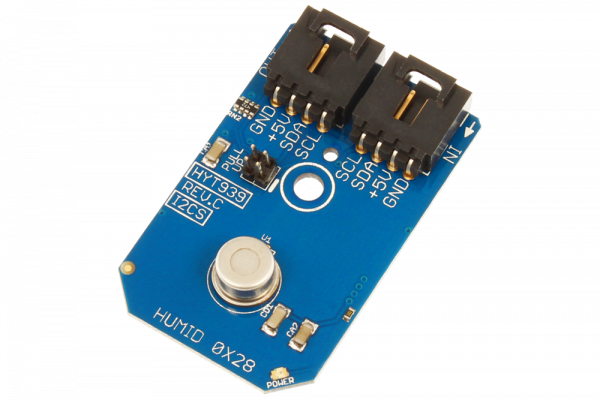

# HYT939

This sensor is not for everyone because of it’s high cost, but if you need the best of the best Temperature and Humidity Sensor money can buy, look no further as few sensors can compare to this gem. Precisely calibrated, the HYT939 delivers an accuracy of ±1.8 % RH and ±0.2 °C. Integrated signal processing is used for measuring the physical parameters of relative humidity and temperature using a convenient I2C interface.
This Device is available from www.ncd.io 

[SKU: HYT939_I2CS]

(https://store.ncd.io/product/hyt939-humidity-and-temperature-sensor-%C2%B11-8rh-%C2%B10-2c-i2c-mini-module/)
This Sample code can be used with Arduino.

Hardware needed to interface HYT939 sensor with Arduino

1. <a href="https://store.ncd.io/product/i2c-shield-for-arduino-nano/">Arduino Nano</a>

2. <a href="https://store.ncd.io/product/i2c-shield-for-arduino-micro-with-i2c-expansion-port/">Arduino Micro</a>

3. <a href="https://store.ncd.io/product/i2c-shield-for-arduino-uno/">Arduino uno</a>

4. <a href="https://store.ncd.io/product/dual-i2c-shield-for-arduino-due-with-modular-communications-interface/">Arduino Due</a>

5. <a href="https://store.ncd.io/product/hyt939-humidity-and-temperature-sensor-%C2%B11-8rh-%C2%B10-2c-i2c-mini-module/">HYT939 Humidity and Temperature Sensor</a>

6. <a href="https://store.ncd.io/product/i%C2%B2c-cable/">I2C Cable</a>

HYT939:

This sensor is not for everyone because of it’s high cost, but if you need the best of the best Temperature and Humidity Sensor money can buy, look no further as few sensors can compare to this gem. Precisely calibrated, the HYT939 delivers an accuracy of ±1.8 % RH and ±0.2 °C. Integrated signal processing is used for measuring the physical parameters of relative humidity and temperature using a convenient I2C interface.

Applications:

• Pressure dew point measurement

• Medical systems

• Autoclaves

• Drying systems 
  
• Laboratories

How to Use the HYT939 Arduino Library

The HYT939 has a number of settings, which can be configured based on user requirements.
          
1.Address calling:The following command is used to call the address of HYT939 sensor to begin the transmission.

               hih.getAddr_HYT939(HYT939_DEFAULT_ADDRESS);   // 0x28
            
2.Temperature measurement:The following command is used to measure the temperature in celcius.            
              
               cTemp = hih.Measure_Temperature();
              
3.Humidity measurement:The following command is used to measure the humidity.            
              
                humidity = hih.Measure_Humidity();
